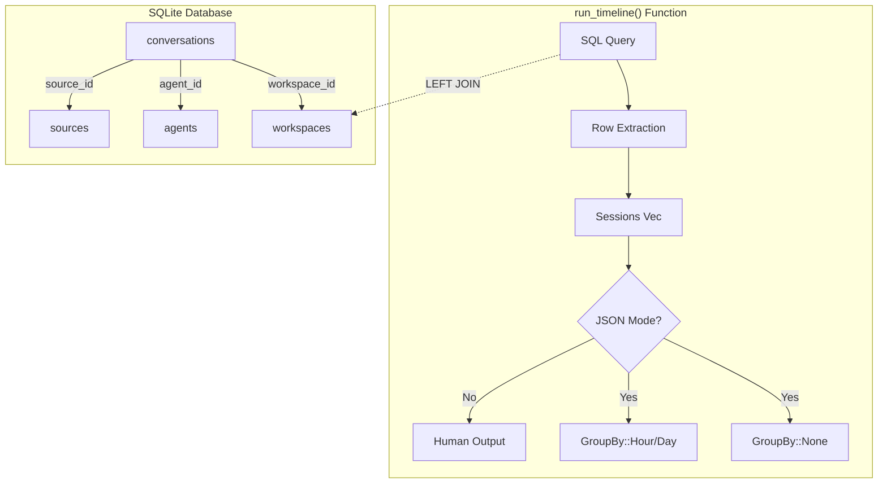
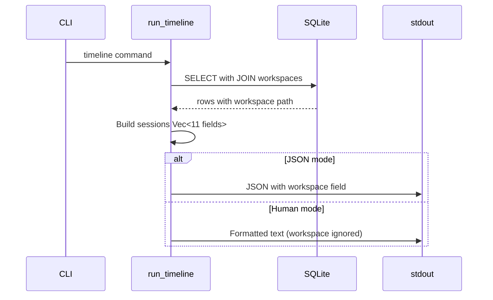

# Detailed Design: Fix Timeline Missing Workspace

**Date:** 2026-01-23
**Type:** Bug Fix
**Status:** Draft

---

## Overview

The `cass timeline` command returns `"workspace": null` for all Claude Code sessions despite the database correctly storing workspace information. This fix adds the missing workspace JOIN and field to the timeline output, enabling downstream tools like `gj last` to properly filter sessions by workspace.

---

## Detailed Requirements

### Functional Requirements

1. **FR-1:** Timeline JSON output MUST include `"workspace": "/path/to/project"` for sessions that have a workspace
2. **FR-2:** Timeline JSON output MUST include `"workspace": null` for sessions without a workspace (correctly null)
3. **FR-3:** Both `--group-by none` and `--group-by hour/day` modes MUST include the workspace field
4. **FR-4:** Non-JSON (human-readable) output MAY omit workspace display (not breaking change)

### Non-Functional Requirements

1. **NFR-1:** No performance regression - single LEFT JOIN on indexed foreign key
2. **NFR-2:** Backwards compatible JSON structure - adding new field, not changing existing
3. **NFR-3:** All existing tests MUST pass

### Acceptance Criteria

- [ ] `cass timeline --json` includes `"workspace": "/path/to/project"` for sessions with workspace
- [ ] `cass timeline --json` includes `"workspace": null` only for sessions without workspace
- [ ] Both `--group-by none` and `--group-by hour/day` modes include workspace
- [ ] `gj last` shows Claude Code sessions when run from a project with matching workspace
- [ ] Existing tests pass
- [ ] No performance regression

---

## Architecture Overview



---

## Components and Interfaces

### Affected Component: `run_timeline` Function

**Location:** `src/lib.rs` (lines 8884-9200)

**Current Interface:**
- Input: date range, agent filter, source filter, grouping mode, JSON flag
- Output: Timeline data (JSON or formatted text)

**Change Summary:**
The function's external interface remains unchanged. Only internal data handling is modified to include the workspace field.

### Data Flow



---

## Data Models

### Current Tuple (10 elements)

```rust
(
    i64,            // id
    String,         // agent
    Option<String>, // title
    i64,            // started_at
    Option<i64>,    // ended_at
    String,         // source_path
    i64,            // message_count
    String,         // source_id
    Option<String>, // origin_host
    Option<String>, // origin_kind
)
```

### New Tuple (11 elements)

```rust
(
    i64,            // id
    String,         // agent
    Option<String>, // title
    i64,            // started_at
    Option<i64>,    // ended_at
    String,         // source_path
    i64,            // message_count
    String,         // source_id
    Option<String>, // origin_host
    Option<String>, // origin_kind
    Option<String>, // workspace <-- NEW
)
```

### JSON Output Schema Change

**Before:**
```json
{
  "id": 123,
  "agent": "claude_code",
  "title": "Session title",
  "started_at": 1705968000000,
  "ended_at": 1705971600000,
  "duration_seconds": 3600000,
  "source_path": "/path/to/session.jsonl",
  "message_count": 42,
  "source_id": "local",
  "origin_kind": "local",
  "origin_host": null
}
```

**After:**
```json
{
  "id": 123,
  "agent": "claude_code",
  "title": "Session title",
  "started_at": 1705968000000,
  "ended_at": 1705971600000,
  "duration_seconds": 3600000,
  "source_path": "/path/to/session.jsonl",
  "message_count": 42,
  "workspace": "/Users/user/Projects/my-project",
  "source_id": "local",
  "origin_kind": "local",
  "origin_host": null
}
```

---

## Implementation Changes

### Change 1: SQL Query

**File:** `src/lib.rs` ~line 8943

Add workspace join and select:

```sql
SELECT c.id, a.slug as agent, c.title, c.started_at, c.ended_at, c.source_path,
       COUNT(m.id) as message_count, c.source_id, c.origin_host, s.kind as origin_kind,
       w.path as workspace
FROM conversations c
JOIN agents a ON c.agent_id = a.id
LEFT JOIN sources s ON c.source_id = s.id
LEFT JOIN messages m ON m.conversation_id = c.id
LEFT JOIN workspaces w ON c.workspace_id = w.id
WHERE c.started_at >= ?1 AND c.started_at <= ?2
```

### Change 2: Row Extraction

**File:** `src/lib.rs` ~line 8998

Add workspace field extraction at index 10:

```rust
row.get::<_, Option<String>>(10)?, // workspace
```

### Change 3: Tuple Type Definition

**File:** `src/lib.rs` ~line 9021

Add `Option<String>` for workspace as 11th element.

### Change 4: JSON Output (None mode)

**File:** `src/lib.rs` ~line 9044

Add `workspace` to destructuring pattern and JSON object.

### Change 5: JSON Output (Hour/Day mode)

**File:** `src/lib.rs` ~line 9080

Add `workspace` to destructuring pattern and JSON object.

### Change 6: Non-JSON Output

**File:** `src/lib.rs` ~line 9149

Add `_workspace` to tuple destructuring (required for compile, not displayed).

---

## Error Handling

No new error handling required. The workspace field uses `LEFT JOIN` and `Option<String>`, so:

- Sessions with workspace → `"workspace": "/path/to/project"`
- Sessions without workspace → `"workspace": null`

This matches the existing pattern for `origin_host` and other nullable fields.

---

## Testing Strategy

### Manual Verification

```bash
# Build and verify compilation
cargo check --all-targets
cargo clippy --all-targets -- -D warnings

# Reindex to ensure fresh data
cass index --full

# Test both grouping modes
cass timeline --since 7d --json --group-by none | \
  jq '.sessions[] | select(.agent == "claude_code") | {workspace, source_path}' | head -10

cass timeline --since 7d --json --group-by day | \
  jq '.groups | to_entries[0].value[] | select(.agent == "claude_code") | {workspace}' | head -5

# Verify non-JSON mode still works
cass timeline --since 1d

# Verify gj last works
cd ~/dev/orchestrator
gj last  # Should now show Claude Code sessions
```

### Existing Test Verification

```bash
cargo test
```

All existing tests must pass. No new tests required for this minimal fix.

---

## Appendices

### A. Technology Choices

| Choice | Rationale |
|--------|-----------|
| LEFT JOIN | Matches existing pattern; handles null workspace_id |
| Option<String> | Rust idiom for nullable database columns |
| Add to existing tuple | Minimal change; avoids refactoring to struct |

### B. Research Findings Summary

1. **Line numbers verified** - All 6 code locations match the original plan
2. **Pattern exists** - Other functions already JOIN workspaces correctly
3. **gj workaround confirmed** - Currently uses source_path matching
4. **No blocking issues** - Straightforward implementation

### C. Alternative Approaches Considered

| Approach | Rejected Because |
|----------|------------------|
| Separate query for workspace | Less efficient; adds latency |
| Refactor to named struct | Scope creep; unnecessary for this fix |
| Add workspace to non-JSON output | Not requested; adds complexity |

### D. Existing Codebase Patterns

**Project Conventions (from AGENTS.md):**
- Rust 2024 edition (nightly)
- Handle `Option<T>` for nullable columns
- Run `cargo check`, `cargo clippy`, `cargo fmt` after changes
- No backwards compatibility shims - just fix directly

**Workspace JOIN pattern (from storage.rs):**
```rust
LEFT JOIN workspaces w ON c.workspace_id = w.id
```

This pattern is used in:
- `list_conversations` (line 978)
- `get_workspace_conversation_count` (line 1071)
- `rebuild_fts_index` (line 1150)
- Stats query (line 4377)
